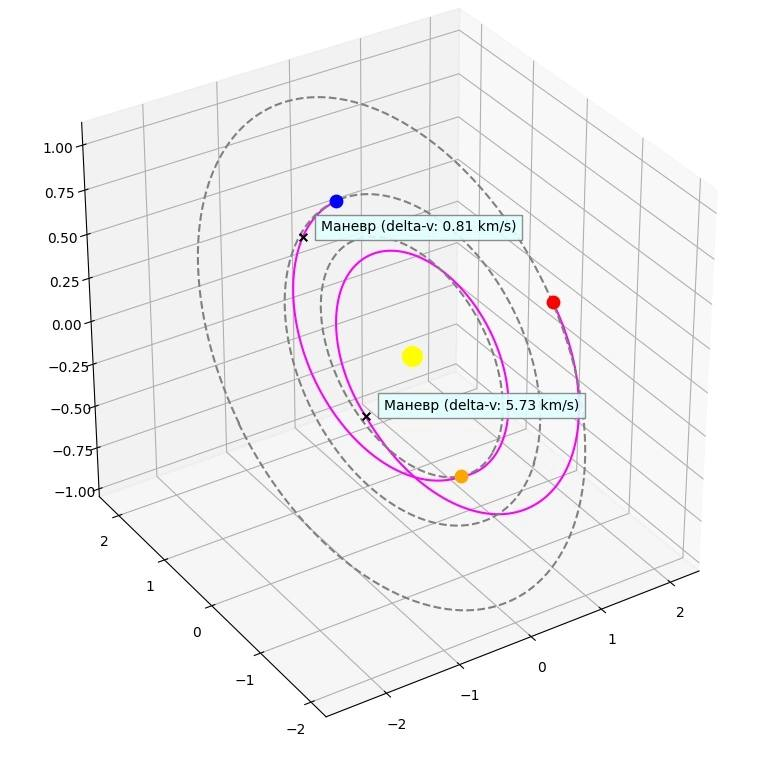

# Project for calculating MGA maneuvers and executing them in KSP!



Using Multiple Gravity Assist (MGA) maneuver algorithm from
"Spacecraft trajectory optimization" book by Bruce A. Conway. Can calculate trajectories for real solar
system and for Kerbol system from Kerbol Space Program game.

After calculation trajectory can be performed by autopilot in KSP.

```python
python -m examples.solar_system_mga
python -m examples.plot_departure
```

## TODO list
- [x] Custom Lambert problem solver
- [x] Plotting the trajectory
- [ ] Make algorithm parallel
- [ ] Add custom feedback attitude control for spacecraft
- [ ] Add ascending node change algorithm 
- [ ] Make node executor in KSP more stable
- [ ] Make escapement maneuver multinode